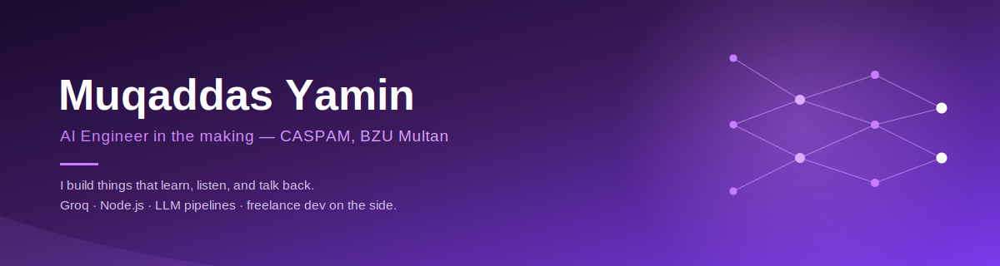

<div align="center">
  
</div>

<br/>

<table width="100%">
<tr>
<td width="65%" valign="top">

### The short version

I'm a third-semester **BS Artificial Intelligence** student at **CASPAM, Bahauddin Zakariya University, Multan** — and somewhere between lectures and late-night debugging, I've built a habit of shipping real, working AI products instead of just prototypes that live in a folder.

My favourite kind of project is the one where an idea turns into a chatbot, a summarizer, or a small business tool that someone actually uses — usually within a few days of me deciding to build it.

</td>
<td width="35%" valign="top">

**Right now**
&nbsp;
🎓 3rd semester, CASPAM
&nbsp;
🛠️ Building a voice summarizer
&nbsp;
💼 Freelancing on Fiverr
&nbsp;
📬 Open to AI/ML internships

</td>
</tr>
</table>

<br/>

## How I got here

```
2023 — 2025   Intermediate (Pre-Medical), Multan
2025          Started BS Artificial Intelligence — CASPAM, BZU Multan
2025 — now    Freelancing on Fiverr · AI chatbot integration & automation
2026          Building end-to-end LLM products: chatbots, summarizers, study tools
```

I didn't start out planning to build chatbots for a living — the pre-medical background is proof of that. What pulled me toward AI was realizing how fast an idea could become something real: a weekend of learning Groq's API turned into a live study assistant used by other students at my university. That feeling is why I keep building.

<br/>

## What I actually build

<table>
<tr>
<td width="50%" valign="top">

**🤖 CASPAM-Bot — AI Study Assistant**

A chatbot built for my own university's students. Node.js/Express backend, Groq's Llama 3.3 70B for answers, Firebase for accounts and history, and a live BZU/HEC-biased search layer so answers stay relevant to Pakistani students specifically.

→ [**See it live**](https://ai-study-assistent-rbbv.onrender.com)

</td>
<td width="50%" valign="top">

**🧠 Neural Insight — Portfolio**

My personal portfolio, built to feel like a small AI product rather than a static page — it includes a simulated decision-making engine, entirely self-contained in one HTML file.

→ [**Take a look**](https://muqaddasyamin502-collab.github.io/Neural-insight/)

</td>
</tr>
<tr>
<td width="50%" valign="top">

**🎙️ AI Voice/Audio Summarizer** *(in progress)*

Groq's Whisper model handles transcription, Llama 3.3 70B turns that into a clean summary. Currently finishing the frontend polish.

</td>
<td width="50%" valign="top">

**🛍️ Friends Traders — Support Agent**

A real client project: a Hinglish-speaking support chatbot for a family crockery business, with a 40-product catalog built in. Deployed and in use.

</td>
</tr>
</table>

<div align="center">

[View current portfolio →](https://muqaddasyamin502-collab.github.io/Portfolio-/) &nbsp;|&nbsp; [Earlier portfolio archive →](https://muqaddasyamin502-collab.github.io/Portfolio-website-/)

</div>

<br/>

## What's in the toolbox

**Languages** — JavaScript · C++ · SQL · HTML/CSS
**Backend** — Node.js · Express · Firebase
**AI** — Groq API (Llama 3.3 70B, Whisper) · prompt engineering · RAG fundamentals
**Deploy** — Vercel · Render
**Other** — Git/GitHub · Excel & data analysis

<br/>

## The numbers, if you're curious

<div align="center">


</div>

<br/>

## Let's talk

I'm actively looking for **AI/ML internships** and open to **freelance work** — if you're building something and think I could help, I'd genuinely like to hear about it.

<div align="center">

[](https://www.linkedin.com/in/muqaddas-yamin-ai-student)
[](https://www.instagram.com/itz._.muqaddas._.rajpoot/)
[](mailto:muqaddasyamin502@gmail.com)

</div>

<br/>

<div align="center">
<sub>Multan, Pakistan · building one small AI product at a time</sub>
</div>
