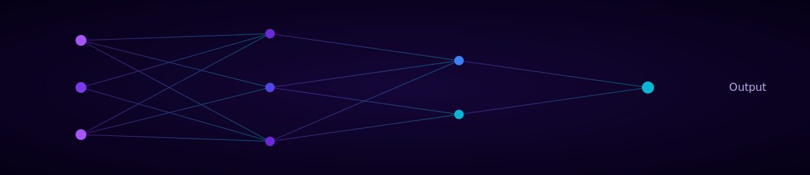
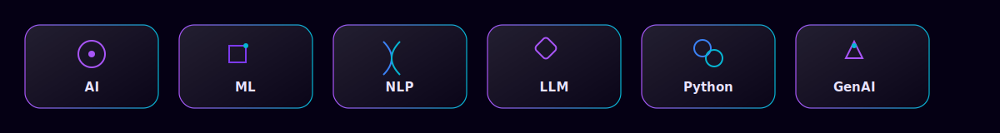

<div align="center">


<br/>


<br/><br/>


[](https://linkedin.com/in/muqaddas-yamin-ai-student)
[](https://www.fiverr.com/muqaddas_yamin)
[](mailto:muqaddasyamin502@gmail.com)

</div>


## 🧠 About Me

```yaml
name: Muqaddas Yamin
role: Artificial Intelligence Student
university: Bahauddin Zakariya University (BZU), Multan, Pakistan
degree: BS Artificial Intelligence (2025 – 2029)
focus: Designing intelligent systems & solving real-world problems
belief: Learning by building practical projects
goal: Becoming an AI Engineer
```

I'm an **Artificial Intelligence student** at **Bahauddin Zakariya University**, based in **Multan, Punjab, Pakistan**, currently pursuing my **BS in Artificial Intelligence (2025–2029)**.

I enjoy designing intelligent systems and solving real-world problems through code. My interests span **Artificial Intelligence, Machine Learning, Deep Learning, Natural Language Processing, and Large Language Models**, alongside strong foundations in **Python, intelligent applications, and software & web development**.

I believe in **learning by building** — every concept I study turns into a hands-on project, from AI chat assistants to full-stack applications. My long-term goal is to grow into a skilled **AI Engineer**, building intelligent software that creates real-world impact.


## 🎓 Education

<table width="100%">
<tr>
<td width="33%" valign="top">

### 🏛️ Bahauddin Zakariya University
**BS Artificial Intelligence**
`2025 – 2029`

CASPAM — Centre for Advanced Studies in Pure and Applied Mathematics

</td>
<td width="33%" valign="top">

### 🏫 Muslim College
**Intermediate (ICS)**
Computer Science
`2023 – 2025`

</td>
<td width="33%" valign="top">

### 🏫 Muslim Group of Schools & Colleges
**FSc Pre-Medical**
`2020 – 2023`

</td>
</tr>
</table>


## 🚀 Featured Projects

<table width="100%">
<tr>
<td width="50%" valign="top">

### 🤖 CASPAM-Bot
AI-powered university assistant built for BZU students.

**Features:** AI Chat · Voice Input · Image Understanding · Document Reading · Student Guidance

`Python` `Flask` `Groq API` `Hugging Face` `HTML` `CSS` `JavaScript`

</td>
<td width="50%" valign="top">

### 🎙️ AI Voice Summarizer
Converts speech to text and generates intelligent summaries using NLP.

**Features:** Speech-to-Text · AI Summarization

`Python` `NLP`

</td>
</tr>
<tr>
<td width="50%" valign="top">

### 📚 AI Study Assistant
A smart chatbot that answers questions from documents using AI.

**Features:** AI Chatbot · Document Q&A · Voice Input · Image Understanding

</td>
<td width="50%" valign="top">

### 🌐 Neural Insight Portfolio
My professional AI-themed portfolio website showcasing my work and skills.

**Features:** Professional AI Portfolio

</td>
</tr>
<tr>
<td width="50%" valign="top">

### 🏺 Friends Traders Website
A responsive business website built for a local crockery business.

**Features:** Responsive Business Website

</td>
<td width="50%" valign="top">

### 🏎️ Object-Oriented Racing Game
A racing game built in C++ to demonstrate core OOP concepts.

**Concepts:** Inheritance · Polymorphism · Encapsulation · File Handling

`C++`

</td>
</tr>
<tr>
<td width="50%" valign="top">

### ⚡ Electricity Bill Management System
A C++ console system for managing customer records and calculating bills.

**Features:** Customer Records · Bill Calculation

`C++`

</td>
<td width="50%" valign="top">

### 🗄️ DreamHome Database System
A relational database project applying core SQL concepts.

**Concepts:** CRUD · Normalization · Relationships

`SQL`

</td>
</tr>
</table>


## 🧩 Tech Stack

**Artificial Intelligence & Machine Learning**


**Programming Languages**


**Frameworks & AI APIs**


**Databases**


**Developer Tools**


**Soft Skills**





## 📖 Currently Learning

<div align="center">


</div>


## 🎯 Career Objective

> To grow as a skilled **AI Engineer**, applying strong foundations in machine learning, deep learning, and software development to design intelligent, reliable systems that solve real-world problems. I aim to keep learning continuously, contribute to impactful AI-driven projects, and build practical solutions that bridge research and real-world application.


## 📊 GitHub Analytics

<div align="center">


</div>

### 🐍 Contribution Snake

<div align="center">

</div>

> 💡 The contribution snake requires a one-time GitHub Actions workflow (`Platane/snk`) added to this repository to generate `github-contribution-grid-snake-dark.svg` on the `output` branch.


<details>
<summary><b>✨ AI Interests Snapshot (click to expand)</b></summary>
<br/>



- 🧠 Artificial Intelligence & Machine Learning fundamentals
- 🔥 Deep Learning architectures and training workflows
- 🗣️ Natural Language Processing & Large Language Models
- ⚙️ Generative AI tools and API integrations
- 💻 Full-stack development for AI-powered applications

</details>

<details>
<summary><b>🛠️ Project Highlights (click to expand)</b></summary>
<br/>

| Project | Category | Core Tech |
|---|---|---|
| CASPAM-Bot | AI Assistant | Python, Flask, Groq API |
| AI Voice Summarizer | Speech + NLP | Python, NLP |
| AI Study Assistant | AI Chatbot | Document Q&A, Voice, Vision |
| Neural Insight Portfolio | Web / Portfolio | HTML, CSS, JS |
| Friends Traders Website | Web / Business | HTML, CSS, JS |
| OOP Racing Game | Systems / Game | C++ |
| Electricity Bill System | Systems | C++ |
| DreamHome Database | Database | SQL |

</details>


## 📬 Contact

<div align="center">

[](https://github.com/muqaddasyamin502-collab)
[](https://linkedin.com/in/muqaddas-yamin-ai-student)
[](mailto:muqaddasyamin502@gmail.com)
[](https://muqaddasyamin502-collab.github.io/Portfolio-/)

</div>


<div align="center">

**Built with 💜 by Muqaddas Yamin — Always Learning, Always Building.**

</div>
